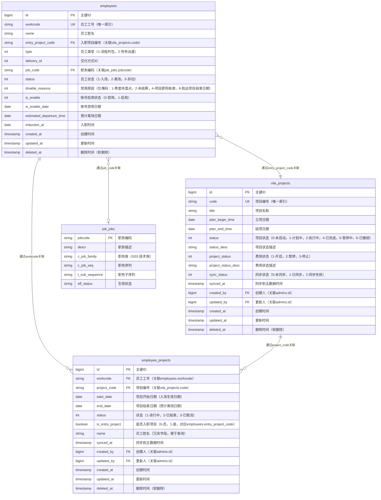
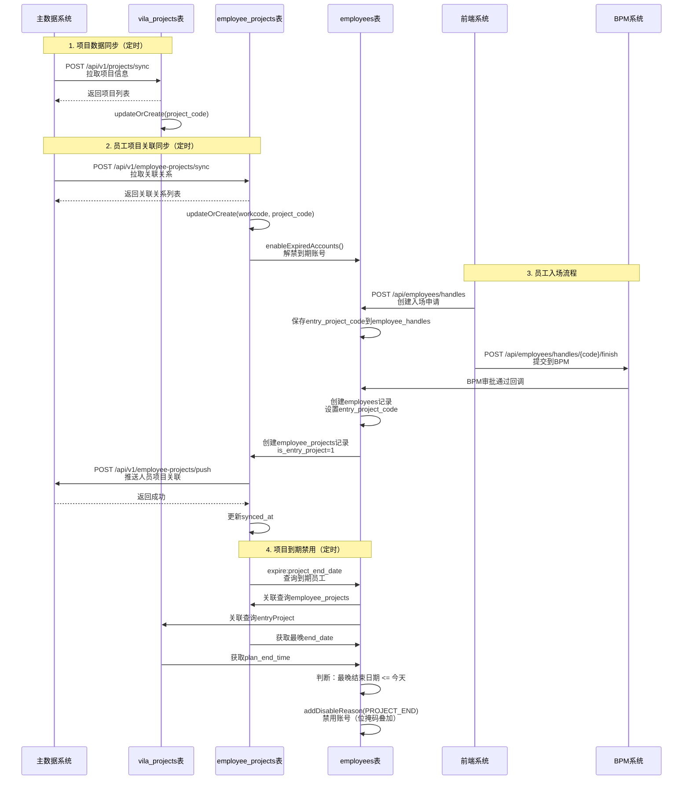

# 技术外包项目制 - 数据存储流转图

## 一、数据表关系图（ER图）

### 1.1 完整ER图



### 1.2 关系说明

#### 1.2.1 employees ↔ vila_projects（一对一）
- **关系类型**：`employees.entry_project_code` → `vila_projects.code`
- **说明**：每个员工可以有一个入职项目（流程外包-技术族必填）
- **关联方式**：通过项目编号（code）关联，而非ID

#### 1.2.2 employees ↔ employee_projects（一对多）
- **关系类型**：`employees.workcode` → `employee_projects.workcode`
- **说明**：一个员工可以关联多个项目（支持一人多项目）
- **关联方式**：通过员工工号（workcode）关联，而非ID

#### 1.2.3 vila_projects ↔ employee_projects（一对多）
- **关系类型**：`vila_projects.code` → `employee_projects.project_code`
- **说明**：一个项目可以关联多个员工
- **关联方式**：通过项目编号（code）关联，而非ID

#### 1.2.4 employees ↔ job_jobc（多对一）
- **关系类型**：`employees.job_code` → `job_jobc.jobcode`
- **说明**：用于判断员工是否属于技术族（`c_job_family = 'G01'`）

### 1.3 关键索引说明

#### employees 表索引
- `workcode`：唯一索引（主键关联）
- `entry_project_code`：普通索引（用于关联查询）
- `job_code`：普通索引（用于技术族判断）
- `type`：普通索引（用于筛选流程外包人员）
- `delivery_id`：普通索引（用于筛选特定交付方式）
- `status`：普通索引（用于筛选在场人员）
- `disable_reasons`：普通索引（用于筛选禁用原因）

#### vila_projects 表索引
- `code`：唯一索引（主键关联）
- `status`：普通索引（用于筛选执行中的项目）
- `project_status`：普通索引（用于筛选开启状态的项目）
- `plan_end_time`：普通索引（用于项目到期判断）
- `sync_status`：普通索引（用于同步状态查询）

#### employee_projects 表索引
- `(workcode, project_code, start_date)`：唯一索引（防止重复关联）
- `workcode`：普通索引（用于查询员工的所有项目）
- `project_code`：普通索引（用于查询项目的所有员工）
- `status`：普通索引（用于筛选进行中的关联）
- `end_date`：普通索引（用于项目到期判断）
- `is_entry_project`：普通索引（用于筛选入职项目）

### 1.4 数据约束说明

1. **唯一性约束**
- `employees.workcode`：员工工号唯一
- `vila_projects.code`：项目编号唯一
- `employee_projects(workcode, project_code, start_date)`：同一员工在同一项目的同一开始日期只能有一条记录

2. **外键约束（逻辑约束，非数据库外键）**
- `employees.entry_project_code` 必须存在于 `vila_projects.code`
- `employee_projects.workcode` 必须存在于 `employees.workcode`
- `employee_projects.project_code` 必须存在于 `vila_projects.code`

3. **业务约束**
- 流程外包-技术族员工（`type=1`, `delivery_id in [1,3,8,10]`, `job_code`属于技术族）必须填写 `entry_project_code`
- `employee_projects.is_entry_project=1` 的记录，其 `project_code` 必须等于对应员工的 `entry_project_code`
- `employee_projects.end_date` 不能早于 `start_date`

## 二、数据流转图

```mermaid
flowchart TB
subgraph "外部系统"
MD[主数据系统<br/>Master Data]
BPM[BPM流程系统]
Frontend[前端系统]
end

subgraph "数据库表"
VP[vila_projects<br/>维拉项目表]
EP[employee_projects<br/>员工项目关联表]
EMP[employees<br/>员工表]
EH[employee_handles<br/>员工入场申请表]
end

subgraph "定时任务"
SyncProjects[定时脚本<br/>sync:projects-from-master-data]
SyncEP[定时脚本<br/>sync:employee-projects-from-master-data]
ExpireCmd[定时脚本<br/>expire:project_end_date<br/>每日00:00执行]
NoticeCmd[定时脚本<br/>notice:project_end<br/>项目即将结束通知]
end

subgraph "业务服务"
EHS[EmployeeHandleService<br/>入场服务]
EPS[EmployeeProjectService<br/>项目关联服务]
MDS[MasterDataService<br/>主数据服务]
end

%% 项目数据同步流程
MD -->|1. 拉取项目信息<br/>POST /api/v1/projects/sync| SyncProjects
SyncProjects -->|2. 更新/创建| VP
VP -->|存储项目信息<br/>code, title, plan_end_time等| VP

%% 员工项目关联同步流程
MD -->|3. 拉取项目人员关联<br/>POST /api/v1/employee-projects/sync| SyncEP
SyncEP -->|4. 更新/创建| EP
EP -->|存储关联关系<br/>workcode, project_code, start_date, end_date| EP
SyncEP -->|5. 解禁到期账号| MDS
MDS -->|enableExpiredAccounts| EMP

%% 员工入场流程
Frontend -->|6. 创建入场申请<br/>POST /api/employees/handles| EHS
EHS -->|7. 保存入场数据<br/>entry_project_code| EH
EH -->|8. 提交到BPM<br/>POST /api/employees/handles/{code}/finish| BPM
BPM -->|9. BPM审批通过回调| EHS
EHS -->|10. 创建员工记录<br/>设置entry_project_code| EMP
EHS -->|11. 创建项目关联<br/>is_entry_project=1| EP
EP -->|12. 推送人员项目关联<br/>POST /api/v1/employee-projects/push| MD
EP -->|更新synced_at| EP

%% 项目到期禁用流程
ExpireCmd -->|13. 查询到期员工<br/>查询条件：<br/>- type=OUT_STAFF<br/>- delivery_id in [1,3,8,10]<br/>- 技术族<br/>- 项目结束日期<=今天| EMP
EMP -->|关联查询| EP
EMP -->|关联查询| VP
EP -->|获取最晚end_date| ExpireCmd
VP -->|获取plan_end_time| ExpireCmd
ExpireCmd -->|14. 禁用账号<br/>addDisableReason<br/>DISABLE_REASON_PROJECT_END| EMP
EMP -->|更新disable_reasons<br/>位掩码叠加| EMP

%% 项目即将结束通知流程
NoticeCmd -->|15. 查询即将结束项目<br/>项目结束日期在下下个月底及之前| EMP
EMP -->|关联查询| VP
VP -->|plan_end_time| NoticeCmd
NoticeCmd -->|16. 发送通知| Frontend

%% 样式定义
classDef external fill:#e1f5ff,stroke:#01579b,stroke-width:2px
classDef table fill:#fff3e0,stroke:#e65100,stroke-width:2px
classDef service fill:#f3e5f5,stroke:#4a148c,stroke-width:2px
classDef command fill:#e8f5e9,stroke:#1b5e20,stroke-width:2px

class MD,BPM,Frontend external
class VP,EP,EMP,EH table
class EHS,EPS,MDS service
class SyncProjects,SyncEP,ExpireCmd,NoticeCmd command
```

## 三、详细数据流转说明

### 3.1 项目数据同步流程（主数据 → 本系统）

```
主数据系统
↓ [定时脚本：每日增量/每周全量]
POST /api/v1/projects/sync
{
sync_type: "incremental|full",
last_sync_time: "2025-01-01 00:00:00"
}
↓
MasterDataService::syncProjectsFromMasterData()
↓
vila_projects 表
├─ code (项目编号，唯一)
├─ title (项目名称)
├─ plan_begin_time (立项日期)
├─ plan_end_time (结项日期)
├─ status (项目状态)
├─ project_status (费用状态)
└─ synced_at (同步时间)
```

### 3.2 员工项目关联同步流程（主数据 → 本系统）

```
主数据系统
↓ [定时脚本：每日增量/每周全量]
POST /api/v1/employee-projects/sync
{
sync_type: "incremental|full",
last_sync_time: "2025-01-01 00:00:00"
}
↓
MasterDataService::syncEmployeeProjectsFromMasterData()
↓
employee_projects 表
├─ workcode (员工工号，关联employees.workcode)
├─ project_code (项目编号，关联vila_projects.code)
├─ start_date (项目开始日期)
├─ end_date (项目结束日期)
├─ status (状态：1-进行中，2-已结束，3-已取消)
├─ is_entry_project (是否入职项目：0-否，1-是)
├─ name (员工姓名，冗余字段)
└─ synced_at (同步时间)
↓
MasterDataService::enableExpiredAccounts()
↓
employees 表
└─ disable_reasons (移除项目到期禁用原因，如果所有原因都清除则解禁)
```

### 3.3 员工入场流程（前端 → BPM → 本系统 → 主数据）

```
前端系统
↓ [创建入场申请]
POST /api/employees/handles
{
work_data: {
entry_project_code: "PRJ001"  // 流程外包-技术族必填
}
}
↓
EmployeeHandleService::create()
↓
employee_handles 表
└─ extra_entry_project_code (临时存储项目编号)
↓ [提交到BPM]
POST /api/employees/handles/{code}/finish
↓
BPM流程系统
↓ [BPM审批通过回调]
ApiController::handleFinish()
↓
EmployeeService::createByHandle()
├─ 创建 employees 记录
│ └─ entry_project_code = "PRJ001"
└─ EmployeeProjectService::createEntryProject()
└─ 创建 employee_projects 记录
├─ workcode = 员工工号
├─ project_code = "PRJ001"
├─ is_entry_project = 1
└─ start_date = 入职日期
↓
MasterDataService::pushEmployeeProjectToMasterData()
↓ [推送人员项目关联]
POST /api/v1/employee-projects/push
{
workcode: "V0010001",
project_code: "PRJ001",
start_date: "2025-01-01",
end_date: "2025-12-31"
}
↓
主数据系统
↓ [返回成功]
employee_projects.synced_at = now()
```

### 3.4 项目到期禁用流程（定时脚本）

```
定时脚本：expire:project_end_date（每日00:00执行）
↓
查询条件：
- employees.type = OUT_STAFF（流程外包）
- employees.delivery_id in [1, 3, 8, 10]
- employees.status = ENTRY_STATE_CONFIRM（在场）
- employees.job_code 属于技术族
- 项目结束日期 <= 今天
↓
关联查询：
├─ employees.employeeProjects (所有项目关联)
└─ employees.entryProject (入职项目)
↓
获取最晚的项目结束日期：
├─ 从 employee_projects.end_date 获取（优先）
└─ 从 vila_projects.plan_end_time 获取（备用）
↓
判断：最晚结束日期 <= 今天
↓
禁用账号：
├─ 如果账号未被禁用：
│ ├─ DisableOutAccountJob::dispatchNow()
│ ├─ employees.is_enable = YACH_ACCOUNT_DISABLE
│ └─ employees.is_enable_date = now()
└─ 添加禁用原因（位掩码叠加）：
└─ employees.addDisableReason(DISABLE_REASON_PROJECT_END)
└─ disable_reasons = disable_reasons | 8
```

### 3.5 项目到期解禁流程（定时脚本）

```
定时脚本：sync:employee-projects-from-master-data
↓
同步完成后调用：
MasterDataService::enableExpiredAccounts()
↓
查询条件：
- employees.type = OUT_STAFF
- employees.delivery_id in [1, 3, 8, 10]
- employees.status = ENTRY_STATE_CONFIRM
- employees.job_code 属于技术族
- employees.hasDisableReason(DISABLE_REASON_PROJECT_END)
↓
关联查询：
├─ employees.employeeProjects (所有项目关联)
└─ employees.entryProject (入职项目)
↓
获取最晚的项目结束日期
↓
判断：最晚结束日期 > 今天
↓
解禁操作：
├─ employees.removeDisableReason(DISABLE_REASON_PROJECT_END)
│ └─ disable_reasons = disable_reasons & ~8
└─ 如果 disable_reasons == 0：
├─ employees.is_enable = YACH_ACCOUNT_ENABLE
└─ employees.is_enable_date = null
```

### 3.6 项目即将结束通知流程（定时脚本）

```
定时脚本：notice:project_end
↓
查询条件：
- employees.type = OUT_STAFF
- employees.delivery_id in [1, 3, 8, 10]
- employees.status = ENTRY_STATE_CONFIRM
- employees.job_code 属于技术族
- employees.entry_project_code 不为空
- vila_projects.plan_end_time 在下下个月底及之前
↓
发送通知：
└─ 通知相关人员项目即将结束
```

## 四、关键数据字段说明

### 4.1 employees 表关键字段

| 字段 | 类型 | 说明 |
|------|------|------|
| `workcode` | string(50) | 员工工号（主键关联） |
| `entry_project_code` | string(100) | 入职项目编号（关联vila_projects.code） |
| `disable_reasons` | int | 禁用原因（位掩码：1-季度待盘点，2-未结算，4-项目即将结束，8-到达项目结束日期） |
| `is_enable` | tinyint | 账号启用状态（0-禁用，1-启用） |
| `is_enable_date` | date | 账号禁用日期 |
| `estimated_departure_time` | date | 预计离场日期 |

### 4.2 vila_projects 表关键字段

| 字段 | 类型 | 说明 |
|------|------|------|
| `code` | string(100) | 项目编号（唯一，主键关联） |
| `title` | string(255) | 项目名称 |
| `plan_begin_time` | date | 立项日期 |
| `plan_end_time` | date | 结项日期（用于判断项目到期） |
| `status` | tinyint | 项目状态（0-未启动，1-计划中，2-执行中，4-已完成，5-暂停中，6-已撤销） |
| `project_status` | tinyint | 费用状态（1-开启，2-暂停，3-停止） |
| `synced_at` | timestamp | 同步到主数据时间 |

### 4.3 employee_projects 表关键字段

| 字段 | 类型 | 说明 |
|------|------|------|
| `workcode` | string(50) | 员工工号（关联employees.workcode） |
| `project_code` | string(100) | 项目编号（关联vila_projects.code） |
| `start_date` | date | 项目开始日期（入场生效日期） |
| `end_date` | date | 项目结束日期（预计离场日期，用于判断项目到期） |
| `status` | tinyint | 状态（1-进行中，2-已结束，3-已取消） |
| `is_entry_project` | boolean | 是否入职项目（0-否，1-是，对应employees.entry_project_code） |
| `name` | string(100) | 员工姓名（冗余字段，便于查询） |
| `synced_at` | timestamp | 同步到主数据时间 |

## 五、数据流转时序图



## 六、数据流转关键点总结

### 6.1 数据同步方向

1. **主数据 → 本系统（拉取）**
- 项目信息：定时脚本同步到 `vila_projects` 表
- 员工项目关联：定时脚本同步到 `employee_projects` 表

2. **本系统 → 主数据（推送）**
- 员工项目关联：入职提交时推送到主数据系统

### 6.2 数据关联方式

1. **employees ↔ vila_projects**
- 通过 `employees.entry_project_code` = `vila_projects.code` 关联

2. **employees ↔ employee_projects**
- 通过 `employees.workcode` = `employee_projects.workcode` 关联

3. **vila_projects ↔ employee_projects**
- 通过 `vila_projects.code` = `employee_projects.project_code` 关联

### 6.3 关键业务逻辑

1. **入职项目绑定**
- 流程外包-技术族员工入职时必须绑定项目
- 存储在 `employees.entry_project_code`
- 同时在 `employee_projects` 表中创建记录，`is_entry_project = 1`

2. **项目到期禁用**
- 查询所有项目关联，获取最晚的结束日期
- 如果最晚结束日期 <= 今天，则禁用账号
- 使用位掩码叠加禁用原因，不影响其他禁用原因

3. **项目到期解禁**
- 同步主数据后，检查项目结束日期
- 如果最晚结束日期 > 今天，则移除项目到期禁用原因
- 只有当所有禁用原因都清除后，才解禁账号

4. **冗余字段**
- `employee_projects.name`：冗余员工姓名，便于查询
- 不冗余可能频繁变化的字段（如 `master_workcode`、`project_name`）