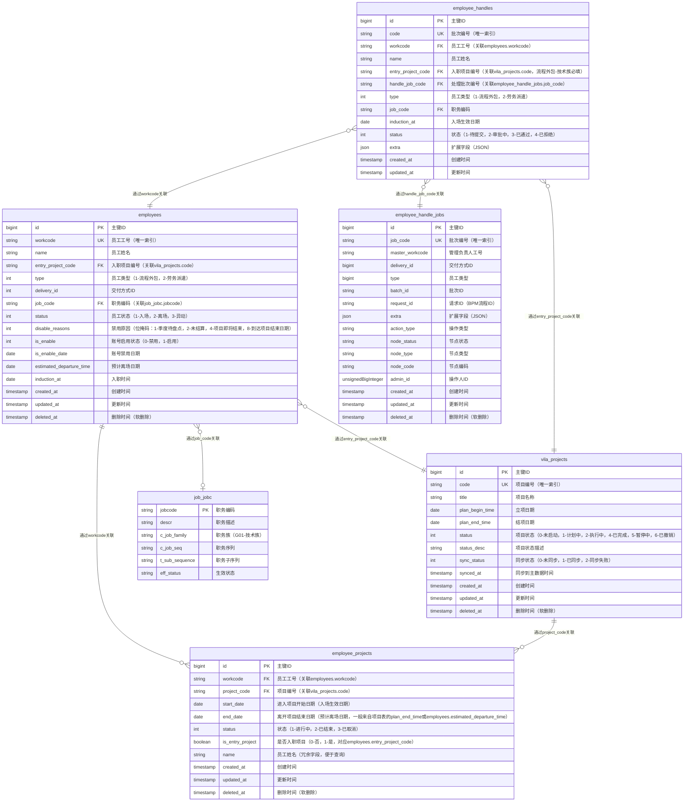

# 未命名文件

## 一、数据表关系图（ER图）

### 1.1 完整ER图

```mermaid
erDiagram
employees ||--o{ employee_projects : "通过workcode关联"
vila_projects ||--o{ employee_projects : "通过project_code关联"
employees }o--|| vila_projects : "通过entry_project_code关联"
employees }o--o| job_jobc : "通过job_code关联"
employee_handles }o--|| vila_projects : "通过entry_project_code关联"
employee_handles }o--|| employees : "通过workcode关联"
employee_handles }o--|| employee_handle_jobs : "通过handle_job_code关联"

employees {
bigint id PK "主键ID"
string workcode UK "员工工号（唯一索引）"
string name "员工姓名"
string entry_project_code FK "入职项目编号（关联vila_projects.code）"
int type "员工类型（1-流程外包，2-劳务派遣）"
int delivery_id "交付方式ID"
string job_code FK "职务编码（关联job_jobc.jobcode）"
int status "员工状态（1-入场，2-离场，3-异动）"
int disable_reasons "禁用原因（位掩码：1-季度待盘点，2-未结算，4-项目即将结束，8-到达项目结束日期）"
int is_enable "账号启用状态（0-禁用，1-启用）"
date is_enable_date "账号禁用日期"
date estimated_departure_time "预计离场日期"
date induction_at "入职时间"
timestamp created_at "创建时间"
timestamp updated_at "更新时间"
timestamp deleted_at "删除时间（软删除）"
}

employee_handles {
bigint id PK "主键ID"
string code UK "批次编号（唯一索引）"
string workcode FK "员工工号（关联employees.workcode）"
string name "员工姓名"
string entry_project_code FK "入职项目编号（关联vila_projects.code，流程外包-技术族必填）"
string handle_job_code FK "处理批次编号（关联employee_handle_jobs.job_code）"
int type "员工类型（1-流程外包，2-劳务派遣）"
string job_code FK "职务编码"
date induction_at "入场生效日期"
int status "状态（1-待提交，2-审批中，3-已通过，4-已拒绝）"
json extra "扩展字段（JSON）"
timestamp created_at "创建时间"
timestamp updated_at "更新时间"
}

employee_handle_jobs {
bigint id PK "主键ID"
string job_code UK "批次编号（唯一索引）"
string master_workcode "管理负责人工号"
bigint delivery_id "交付方式ID"
bigint type "员工类型"
string batch_id "批次ID"
string request_id "请求ID（BPM流程ID）"
json extra "扩展字段（JSON）"
string action_type "操作类型"
string node_status "节点状态"
string node_type "节点类型"
string node_code "节点编码"
unsignedBigInteger admin_id "操作人ID"
timestamp created_at "创建时间"
timestamp updated_at "更新时间"
timestamp deleted_at "删除时间（软删除）"
}

vila_projects {
bigint id PK "主键ID"
string code UK "项目编号（唯一索引）"
string title "项目名称"
date plan_begin_time "立项日期"
date plan_end_time "结项日期"
int status "项目状态（0-未启动，1-计划中，2-执行中，4-已完成，5-暂停中，6-已撤销）"
string status_desc "项目状态描述"
int sync_status "同步状态（0-未同步，1-已同步，2-同步失败）"
timestamp synced_at "同步到主数据时间"
timestamp created_at "创建时间"
timestamp updated_at "更新时间"
timestamp deleted_at "删除时间（软删除）"
}

employee_projects {
bigint id PK "主键ID"
string workcode FK "员工工号（关联employees.workcode）"
string project_code FK "项目编号（关联vila_projects.code）"
date start_date "进入项目开始日期（入场生效日期）"
date end_date "离开项目结束日期（预计离场日期，一般来自项目表的plan_end_time或employees.estimated_departure_time）"
int status "状态（1-进行中，2-已结束，3-已取消）"
boolean is_entry_project "是否入职项目（0-否，1-是，对应employees.entry_project_code）"
string name "员工姓名（冗余字段，便于查询）"
timestamp created_at "创建时间"
timestamp updated_at "更新时间"
timestamp deleted_at "删除时间（软删除）"
}

job_jobc {
string jobcode PK "职务编码"
string descr "职务描述"
string c_job_family "职务族（G01-技术族）"
string c_job_seq "职务序列"
string t_sub_sequence "职务子序列"
string eff_status "生效状态"
}
```